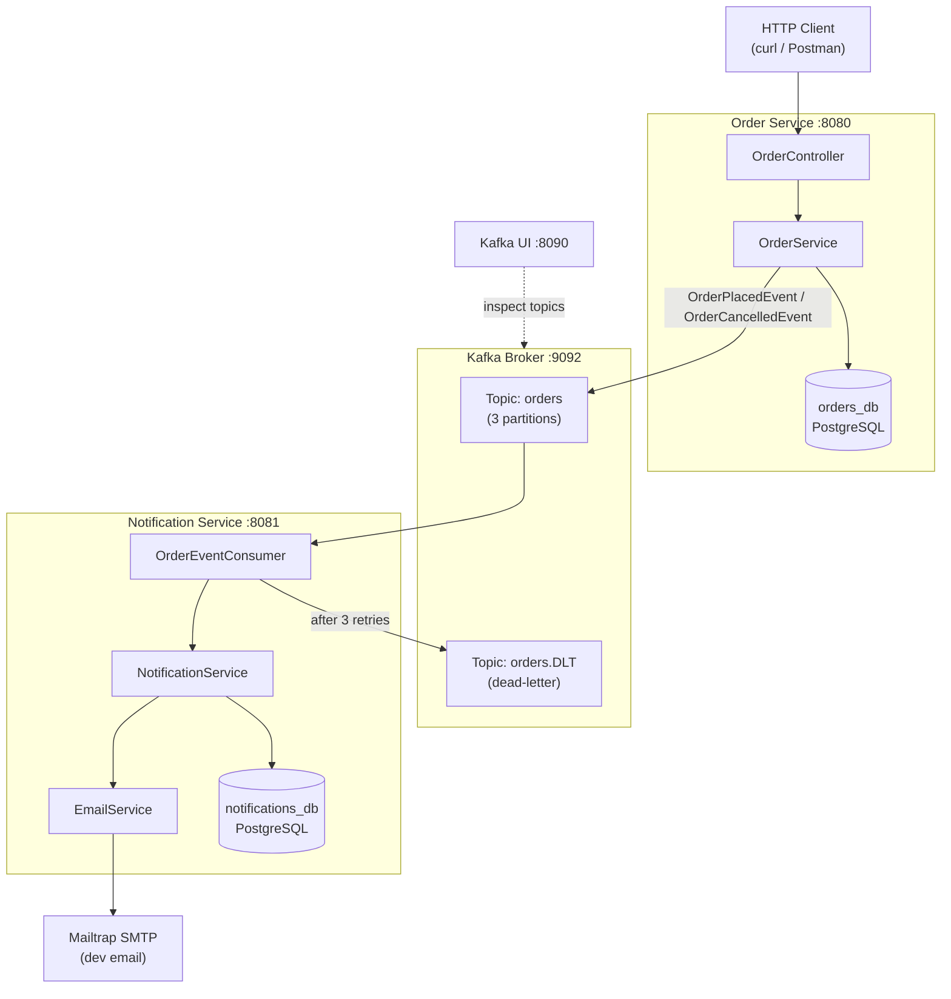

# EventFlow — Kafka Notification Service

A two-service Spring Boot application demonstrating **event-driven architecture** with Apache Kafka.

---

## Architecture



---

## What This Project Demonstrates

| Concept | Implementation |
|---|---|
| Event-driven architecture | Order events published to Kafka, consumed asynchronously |
| Async decoupling | Order Service doesn't know about Notification Service |
| Multi-service Docker | Both services + infra wired via Docker Compose |
| Dead-letter topic | Failed messages routed to `orders.DLT` after retry exhaustion |
| Exponential backoff | 1s → 2s → 4s retry on consumer failures |
| Database migrations | Flyway manages schema for both services |
| Global exception handling | RFC 9457 `ProblemDetail` responses in Order Service |

---

## Prerequisites

- Docker & Docker Compose v2+
- (Optional) Java 21 + Maven for local development

---

## Running Locally

### 1. Clone & configure

```bash
git clone <repo-url>
cd eventflow
cp .env.example .env
# Edit .env — add your Mailtrap SMTP credentials
```

### 2. Start everything

```bash
docker-compose up --build
```

All services will start in dependency order:
- Zookeeper → Kafka → PostgreSQL → Order Service → Notification Service
- Kafka UI: http://localhost:8090

### 3. Stop

```bash
docker-compose down          # keep volumes
docker-compose down -v       # also wipe DB data
```

---

## Example curl Commands

### Place an order
```bash
curl -s -X POST http://localhost:8080/api/orders \
  -H "Content-Type: application/json" \
  -d '{
    "customerEmail": "alice@example.com",
    "productName": "Mechanical Keyboard",
    "quantity": 1,
    "totalPrice": 129.99
  }' | jq
```

Response:
```json
{
  "id": "3fa85f64-5717-4562-b3fc-2c963f66afa6",
  "customerEmail": "alice@example.com",
  "productName": "Mechanical Keyboard",
  "quantity": 1,
  "totalPrice": 129.99,
  "status": "PLACED",
  "createdAt": "2026-02-21T10:00:00Z"
}
```

### Fetch an order
```bash
curl -s http://localhost:8080/api/orders/<order-id> | jq
```

### Cancel an order
```bash
curl -s -X POST http://localhost:8080/api/orders/<order-id>/cancel | jq
```

### List all notifications
```bash
curl -s http://localhost:8081/api/notifications | jq
```

---

## Service Endpoints

| Service | Port | Endpoints |
|---|---|---|
| Order Service | 8080 | `POST /api/orders` `GET /api/orders/{id}` `POST /api/orders/{id}/cancel` |
| Notification Service | 8081 | `GET /api/notifications` |
| Kafka UI | 8090 | Web interface — browse topics, messages, consumer groups |

---

## Project Structure

```
eventflow/
├── docker-compose.yml
├── init-db.sql                        # Creates orders_db & notifications_db
├── .env.example
├── .github/workflows/ci.yml
├── order-service/
│   ├── Dockerfile
│   ├── pom.xml
│   └── src/main/java/com/eventflow/orderservice/
│       ├── controller/OrderController.java
│       ├── service/OrderService.java
│       ├── event/          # OrderPlacedEvent, OrderCancelledEvent (records)
│       ├── model/Order.java
│       ├── dto/            # CreateOrderRequest, OrderResponse (records)
│       ├── exception/      # GlobalExceptionHandler, OrderNotFoundException
│       └── config/KafkaProducerConfig.java
└── notification-service/
    ├── Dockerfile
    ├── pom.xml
    └── src/main/java/com/eventflow/notificationservice/
        ├── consumer/OrderEventConsumer.java
        ├── service/NotificationService.java + EmailService.java
        ├── event/          # Mirror records — no shared JAR, JSON-coupled
        ├── model/Notification.java
        ├── controller/NotificationController.java
        └── config/KafkaConsumerConfig.java + KafkaProducerConfig.java
```

---

## Running Tests

```bash
# Order Service unit + integration tests
cd order-service && mvn test

# Notification Service unit tests
cd notification-service && mvn test
```

The integration test uses `@EmbeddedKafka` — no Docker required.

---

## CI/CD

GitHub Actions (`.github/workflows/ci.yml`) runs on every push:
1. Builds and tests both services in parallel
2. On `main` branch: builds both Docker images (push to registry disabled by default — add Docker Hub credentials to enable)

---

## Configuration Reference

| Environment Variable | Default | Description |
|---|---|---|
| `SPRING_DATASOURCE_URL` | `jdbc:postgresql://localhost:5432/...` | DB connection |
| `SPRING_KAFKA_BOOTSTRAP_SERVERS` | `localhost:9092` | Kafka brokers |
| `MAIL_HOST` | `sandbox.smtp.mailtrap.io` | SMTP host |
| `MAIL_PORT` | `2525` | SMTP port |
| `MAIL_USERNAME` | — | Mailtrap username |
| `MAIL_PASSWORD` | — | Mailtrap password |
