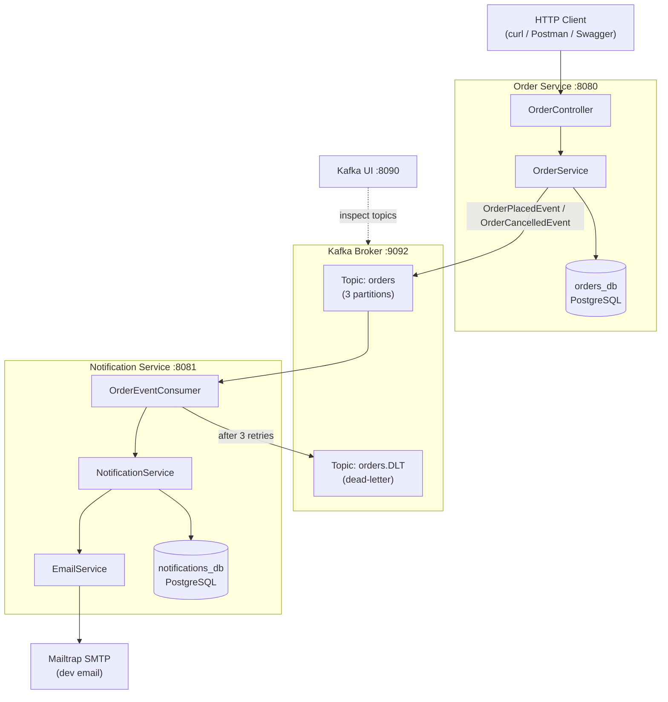

# EventFlow — Kafka Notification Service

A two-service Spring Boot application demonstrating **event-driven architecture** with Apache Kafka.

---

## Architecture



---

## What This Project Demonstrates

| Concept | Implementation |
|---|---|
| Event-driven architecture | Order events published to Kafka, consumed asynchronously |
| Async decoupling | Order Service has no compile-time dependency on Notification Service |
| Type-safe event routing | Kafka type headers (`__TypeId__`) + per-service type mappings — no shared JAR |
| Java 21 pattern matching | `switch` on event type in `OrderEventConsumer` |
| Dead-letter topic | Failed messages routed to `orders.DLT` after retry exhaustion |
| Exponential backoff | 1 s → 2 s → 4 s retry on consumer failures (3 attempts) |
| Resilient email delivery | Email failures saved as `FAILED` notifications; event not lost |
| Database migrations | Flyway manages schema for both services independently |
| RFC 9457 error responses | `ProblemDetail` used for all error responses in Order Service |
| Multi-service Docker | Both services + all infra wired via a single `docker-compose.yml` |

---

## Prerequisites

- Docker & Docker Compose v2+
- (Optional) Java 21 + Maven for running tests locally

---

## Running Locally

### 1. Clone & configure

```bash
git clone https://github.com/AbaSheger/eventflow.git
cd eventflow
cp .env.example .env
# Edit .env — add your Mailtrap SMTP credentials (only these two lines needed)
```

### 2. Start everything

```bash
docker-compose up --build
```

Services start in dependency order: Zookeeper → Kafka → PostgreSQL → Order Service → Notification Service

| URL | Description |
|---|---|
| http://localhost:8080/swagger-ui.html | Order Service — API docs & testing |
| http://localhost:8081/swagger-ui.html | Notification Service — API docs & testing |
| http://localhost:8090 | Kafka UI — browse topics, messages, consumer groups |

### 3. Stop

```bash
docker-compose down          # keep volumes (DB data preserved)
docker-compose down -v       # also wipe DB data
```

---

## API Endpoints

### Order Service (`localhost:8080`)

| Method | Path | Description |
|---|---|---|
| `POST` | `/api/orders` | Place a new order — publishes `OrderPlacedEvent` |
| `GET` | `/api/orders/{id}` | Get order by ID |
| `POST` | `/api/orders/{id}/cancel` | Cancel an order — publishes `OrderCancelledEvent` |

### Notification Service (`localhost:8081`)

| Method | Path | Description |
|---|---|---|
| `GET` | `/api/notifications` | List all notifications, newest first |

---

## Example curl Commands

### Place an order
```bash
curl -s -X POST http://localhost:8080/api/orders \
  -H "Content-Type: application/json" \
  -d '{
    "customerEmail": "alice@example.com",
    "productName": "Mechanical Keyboard",
    "quantity": 1,
    "totalPrice": 129.99
  }' | jq
```

Response (`201 Created`):
```json
{
  "id": "3fa85f64-5717-4562-b3fc-2c963f66afa6",
  "customerEmail": "alice@example.com",
  "productName": "Mechanical Keyboard",
  "quantity": 1,
  "totalPrice": 129.99,
  "status": "PLACED",
  "createdAt": "2026-02-21T10:00:00Z"
}
```

### Get an order
```bash
curl -s http://localhost:8080/api/orders/<order-id> | jq
```

### Cancel an order
```bash
curl -s -X POST http://localhost:8080/api/orders/<order-id>/cancel | jq
```

Response (`200 OK`):
```json
{
  "id": "3fa85f64-5717-4562-b3fc-2c963f66afa6",
  "status": "CANCELLED",
  ...
}
```

### List notifications
```bash
curl -s http://localhost:8081/api/notifications | jq
```

After placing and then cancelling an order you will see two entries — `ORDER_PLACED` and `ORDER_CANCELLED` — for the same `orderId`. Kafka consumption is asynchronous; allow ~1 second after each action before querying.

---

## Postman Collections

Import into Postman for a ready-made request suite:

- `order-service/postman/order-service.postman_collection.json`
- `notification-service/postman/notification-service.postman_collection.json`

---

## Project Structure

```
eventflow/
├── docker-compose.yml
├── init-db.sql                        # Creates orders_db & notifications_db
├── .env.example                       # MAILTRAP_USERNAME / MAILTRAP_PASSWORD
├── .github/workflows/ci.yml
├── order-service/
│   ├── Dockerfile
│   ├── pom.xml
│   └── src/
│       ├── main/java/com/eventflow/orderservice/
│       │   ├── controller/OrderController.java
│       │   ├── service/OrderService.java
│       │   ├── event/          # OrderPlacedEvent, OrderCancelledEvent (records)
│       │   ├── model/Order.java
│       │   ├── dto/            # CreateOrderRequest, OrderResponse (records)
│       │   ├── exception/      # GlobalExceptionHandler (ProblemDetail), OrderNotFoundException
│       │   └── config/KafkaProducerConfig.java
│       └── test/java/com/eventflow/orderservice/
│           ├── service/OrderServiceTest.java              # Mockito unit tests
│           └── integration/OrderKafkaIntegrationTest.java # @EmbeddedKafka + H2
└── notification-service/
    ├── Dockerfile
    ├── pom.xml
    └── src/
        ├── main/java/com/eventflow/notificationservice/
        │   ├── consumer/OrderEventConsumer.java      # Java 21 pattern switch
        │   ├── service/NotificationService.java
        │   ├── service/EmailService.java
        │   ├── event/          # Mirror records — JSON-coupled, no shared JAR
        │   ├── model/Notification.java
        │   ├── controller/NotificationController.java
        │   └── config/
        │       ├── KafkaConsumerConfig.java          # ErrorHandlingDeserializer + DLT
        │       └── KafkaProducerConfig.java          # KafkaTemplate for DLT publisher
        └── test/java/com/eventflow/notificationservice/
            └── service/NotificationServiceTest.java  # Mockito unit tests
```

---

## Running Tests

```bash
# Order Service — unit tests + Kafka integration test
cd order-service && mvn test

# Notification Service — unit tests
cd notification-service && mvn test
```

The order service integration test (`OrderKafkaIntegrationTest`) uses `@EmbeddedKafka` and H2 in PostgreSQL-compatibility mode — no Docker required.

---

## CI/CD

GitHub Actions (`.github/workflows/ci.yml`) runs on every push to any branch and on pull requests to `main`:

1. **Build & test** both services in parallel (Java 21, Maven)
2. **Upload** Surefire test reports as build artifacts
3. **Build Docker images** — only on the `main` branch (`push: false` by default; add Docker Hub credentials to enable pushing)

---

## Configuration Reference

Only two values need to be supplied when running locally — everything else is pre-configured in `docker-compose.yml`:

| Variable in `.env` | Description |
|---|---|
| `MAILTRAP_USERNAME` | Mailtrap inbox username (get from mailtrap.io) |
| `MAILTRAP_PASSWORD` | Mailtrap inbox password |

The following are set automatically inside `docker-compose.yml` and don't need to be changed for local development:

| Environment Variable | Value |
|---|---|
| `SPRING_DATASOURCE_URL` | `jdbc:postgresql://postgres:5432/orders_db` (or `notifications_db`) |
| `SPRING_KAFKA_BOOTSTRAP_SERVERS` | `kafka:29092` (internal Docker network) |
| `MAIL_HOST` | `sandbox.smtp.mailtrap.io` |
| `MAIL_PORT` | `2525` |
